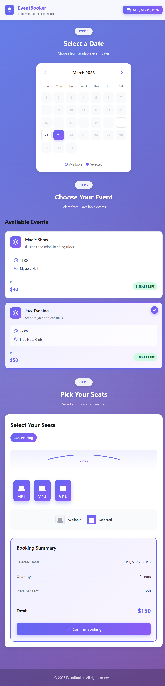

# 🎟️ Event Seat Booking App

A modern, responsive React application for booking event seats with an intuitive date selection, event browsing, and seat selection interface.

## ✨ Features

- 📅 **Interactive Date Picker** - Visual calendar with highlighted available dates
- 🎭 **Event Browser** - Browse multiple events with detailed information
- 💺 **Seat Selection** - Interactive seat map with real-time availability
- 💾 **Session Persistence** - Bookings saved in browser session storage
- 💰 **Price Calculator** - Automatic total price calculation
- ✅ **Booking Confirmation** - Beautiful modal with booking summary
- 📱 **Fully Responsive** - Optimized for desktop, tablet, and mobile devices
- 🎨 **Modern UI/UX** - Smooth animations and gradient designs

## 🚀 Getting Started

### Prerequisites

- Node.js (v14 or higher)
- npm or yarn

### Installation

1. Clone the repository

```bash
git clone <repository-url>
cd react-event-seat-booking
```

2. Install dependencies

```bash
npm install
```

3. Start the development server

```bash
npm run dev
```

4. Open your browser and navigate to `http://localhost:5173`

## 📁 Project Structure

```
## 📁 Project Structure

react-event-seat-booking/
│
├─ src/
│  │
│  ├─ components/
│  │  ├─ context/
│  │  │  └─ bookingContext.jsx   # Global booking state (React Context)
│  │  │
│  │  ├─ dateSelector/           # Date selection component
│  │  ├─ eventDetails/           # Event list and details view
│  │  ├─ seatSelector/           # Seat selection interface
│  │  ├─ eventBooking/           # Main layout container
│  │  └─ bookingModal/           # Booking confirmation modal
│  │
│  ├─ data/
│  │  └─ eventsData.js           # Mock event data source
│  │
│  ├─ App.jsx                    # Root component
│  ├─ main.jsx                   # Application entry point
│  └─ index.css                  # Global styles
│
├─ package.json
└─ README.md

```

## 🎯 How to Use

1. **Select a Date** - Click on any highlighted date in the calendar
2. **Choose an Event** - Browse and select your preferred event
3. **Pick Your Seats** - Click on available seats to select/deselect them
4. **Confirm Booking** - Review your selection and click "Confirm Booking"
5. **Get Confirmation** - View your booking summary in the modal

## 🛠️ Technologies Used

- **React** - UI library
- **CSS Modules** - Scoped styling
- **Session Storage** - Data persistence
- **Vite** - Build tool

## 📱 Responsive Breakpoints

- **Desktop**: > 768px
- **Tablet**: 480px - 768px
- **Mobile**: < 480px

## 🎨 Design Features

- Gradient backgrounds and buttons
- Smooth hover effects and transitions
- Custom SVG icons
- Glass morphism effects
- Modern color scheme (Indigo/Purple palette)

## 📝 License

MIT License - feel free to use this project for personal or commercial purposes.

## 👨‍💻 Author

Created with ❤️ for seamless event booking experiences.

---

## 📸 Screenshot



---

**Happy Booking! 🎉**
